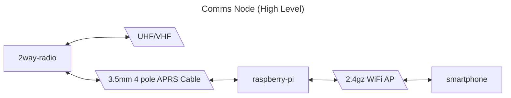
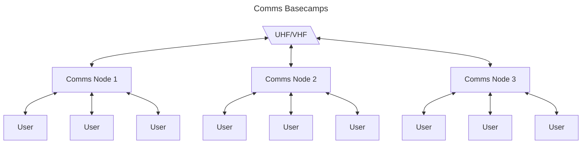
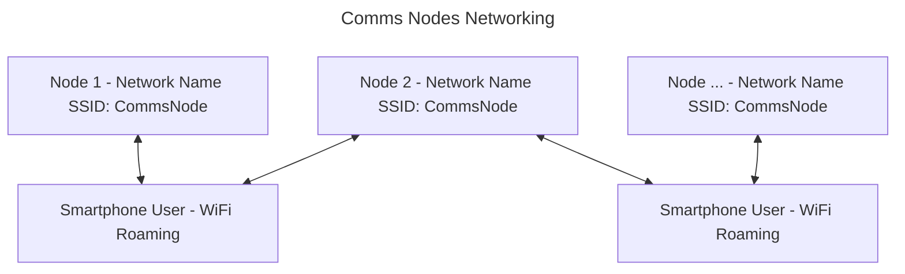

# Lazztech.Comms Project Architecture Design Document

The objective of this project is fundementally to produce a convenient to deploy and use off grid communication tool. The intention is to expose a web app so that users may connect over a wifi access point with the smart phones they already have and share a two way radio located centrally to their base camp.

This would then allow for comms to be easily deployed and shared upon each base camp.





## 1 - Networking
The objective of this section is to capture the WiFi capabilities and requirement designs. This includes ensuring support for WiFi Roaming between nodes (See appendix link #1).

- connect to AP via qr code



## 2 - Hardware

Fundementally there are 3 components to setting up a "Comms Node", a computer with WiFi that can serve an access point, a 2 way radio (See appendix link #2), and a means of wiring the radio as an audio input/output device to the computer (See appendix link #3). This has been verified to work as an audio input/output from a computer, while the 2 way radio is configured to enable VOX.

## 3 - Backend
For the backend NestJS will be used (See appendix link #4).

### 3.1 - Audio
Audio manipulation and HLS stream will be managed with ffmpeg(see appendix #5).

This will take place as a child process of the backend, which will be instructed to form an HLS stream from the microphone input, which will be taken from the output of the 2 way radio. It will then be served via the nestjs Serve Static module.

```
# example route of hls stream being served
http://localhost:3000/output.m3u8
```

Additionally FFMPEG may be instructed to keep a set number of HLS segments then auto delete the old segments. This reduces file storage concerns as it cleans up after itself.

### 3.2 - Notifications
- https://docs.nestjs.com/techniques/server-sent-events
- https://medium.com/@dnyaneshwarsukashe/implementing-web-push-notifications-in-angular-and-nestjs-4d33a8e14af5

## 4 - Frontend
Low-js HOWL Stack(Hypermedia On Whatever you’d Like). And what I'd like is NestJS MVC with HandlebarsJS as the templating engine. For styling pines UI fills any remaining gaps with a tailwind and alpinejs based component library.

- https://htmx.org/
- https://alpinejs.dev/
- https://tailwindcss.com/
- https://devdojo.com/pines

## Revision History

| # |  Description | Date |
| -------- | ------- | ------- |
| 1 | Initial Design | 5/13/24 |

## Appendix

**Section A - Terms:**
1. Low-JS
2. HOWL Stack
3. NestJS
4. MVC
5. HandlebarsJS
6. Tailwind
7. Alpinejs

**Section B - References:**
1. https://community.fs.com/article/what-is-wifi-roaming-and-how-does-it-work.html
2. TIDRADIO TD-H3 GMRS Radio https://a.co/d/cGzM4UL
3. K type APRS Cable https://a.co/d/e2LOQvZ
4. https://docs.nestjs.com
5. https://www.npmjs.com/package/@mrkwskiti/fluent-ffmpeg-nestjs
2. [Initializing NestJS app within NPM workspaces](https://www.youtube.com/watch?v=tLyis8c4vC0)