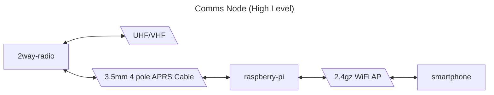
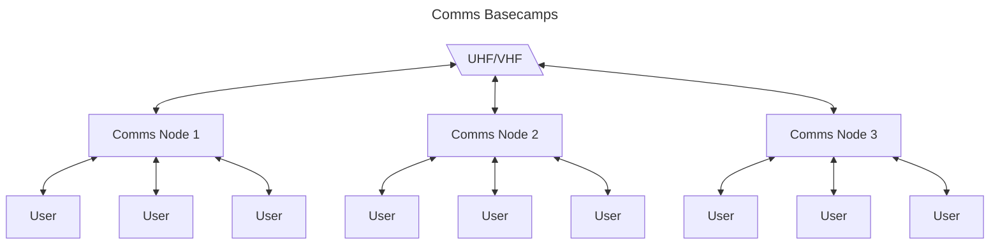
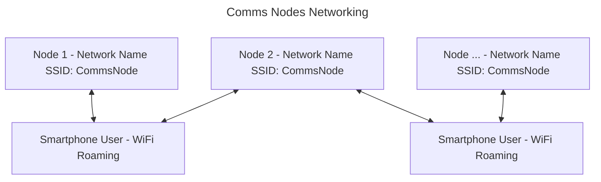

# Comms by Lazztech Design Document

The objective of this project is fundementally to produce a convenient to deploy and use off grid communication tool. The intention is to expose a web app so that users may connect over a wifi access point with the smart phones they already have and share a two way radio located centrally to their base camp.

This would then allow for comms to be easily deployed and shared upon each base camp.





## Networking

- wifi roaming
- connect to AP via nfc
- connect to AP via qr code


Links:
- https://www.reddit.com/r/HomeNetworking/comments/hxal50/multiple_access_points_with_the_same_ssid/

## Hardware

Fundementally there are 3 components to setting up a "Comms Node", a computer with WiFi that can serve an access point, a 2 way radio, and a means of wiring the radio as an audio input/output device to the computer.

#### P.O.C. Setup:
- TIDRADIO TD-H3 GMRS Radio https://a.co/d/cGzM4UL
- K type APRS Cable https://a.co/d/e2LOQvZ

## Backend
- https://docs.nestjs.com/

**Persistance:**
- Mikroorm
- SQLite
- Local Filestorage

**Audio:**
- https://www.npmjs.com/package/@mrkwskiti/fluent-ffmpeg-nestjs
- https://github.com/fluent-ffmpeg/node-fluent-ffmpeg

**Notifications:**
- https://docs.nestjs.com/techniques/server-sent-events
- https://medium.com/@dnyaneshwarsukashe/implementing-web-push-notifications-in-angular-and-nestjs-4d33a8e14af5

## Frontend
- https://nextjs.org/
- https://daisyui.com/
- https://medium.com/readytowork-org/implementing-pwa-in-the-next-13-application-3e46f6b3f6d8
- https://www.npmjs.com/package/next-pwa

## Devops

**Monorepo:**
https://docs.npmjs.com/cli/v10/using-npm/workspaces
https://www.youtube.com/watch?v=tLyis8c4vC0

```bash
$ npm init -y
$ mkdir packages
```

Add `"workspaces": ["./packages/*"],` to the `package.json`.

**Nest.js workspace:**

```bash
$ cd packages
$ nest new backend --skip-git --skip-install
```

**Next.js workspace:**