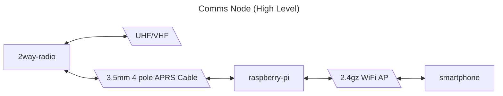
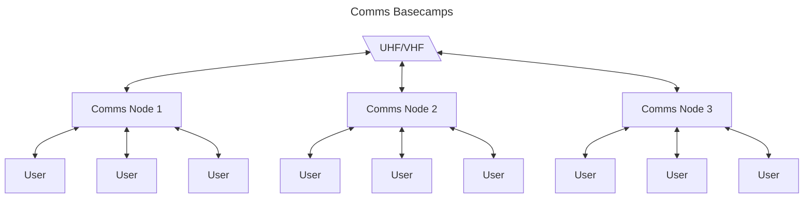

# Comms by Lazztech Design Document

The objective of this project is fundementally to produce a convenient to deploy and use off grid communication tool. The intention is to expose a web app so that users may connect over a wifi access point with the smart phones they already have and share a two way radio located centrally to their base camp.

This would then allow for comms to be easily deployed and shared upon each base camp.

## Hardware

## Frontend

## Backend

## Appendix