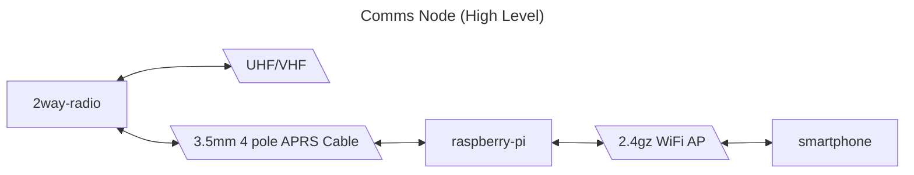
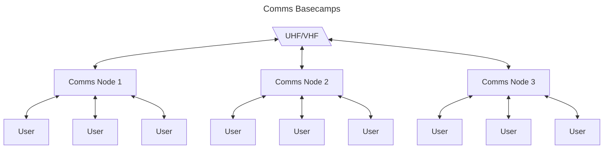
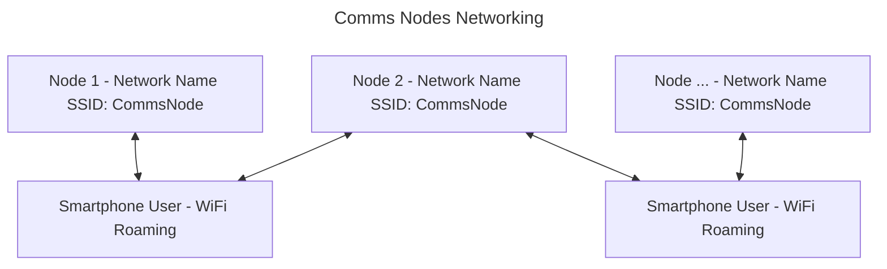

# Section 1.0 - Comms by Lazztech Design Document

The objective of this project is fundementally to produce a convenient to deploy and use off grid communication tool. The intention is to expose a web app so that users may connect over a wifi access point with the smart phones they already have and share a two way radio located centrally to their base camp.

This would then allow for comms to be easily deployed and shared upon each base camp.





## Section 1.1 - Networking
The objective of this section is to capture the WiFi capabilities and requirement designs. This includes ensuring support for WiFi Roaming between nodes (See appendix link #1).

- wifi roaming
- connect to AP via qr code



## Section 1.2 - Hardware

Fundementally there are 3 components to setting up a "Comms Node", a computer with WiFi that can serve an access point, a 2 way radio, and a means of wiring the radio as an audio input/output device to the computer.

**Section 1.2.3 - P.O.C. Setup:**
- TIDRADIO TD-H3 GMRS Radio https://a.co/d/cGzM4UL
- K type APRS Cable https://a.co/d/e2LOQvZ

## Section 1.3 - Backend
- https://docs.nestjs.com/

**Section 1.3.1 - Persistance:**
- Mikroorm
- SQLite
- Local Filestorage

**Section 1.3.2 - Audio:**
- https://www.npmjs.com/package/@mrkwskiti/fluent-ffmpeg-nestjs
- https://github.com/fluent-ffmpeg/node-fluent-ffmpeg

**Section 1.3.3 - Notifications:**
- https://docs.nestjs.com/techniques/server-sent-events
- https://medium.com/@dnyaneshwarsukashe/implementing-web-push-notifications-in-angular-and-nestjs-4d33a8e14af5

## Section 1.4 - Frontend
- https://nextjs.org/
- https://daisyui.com/
- https://medium.com/@mertenercan/nextjs-14-offline-page-with-pwa-6868c02bfefb
- https://www.npmjs.com/package/next-pwa

## Section 1.5 - Devops

**Section 1.5.1 - Monorepo:**
https://docs.npmjs.com/cli/v10/using-npm/workspaces
https://www.youtube.com/watch?v=tLyis8c4vC0

```bash
$ npm init -y
$ mkdir packages
```

Add `"workspaces": ["./packages/*"],` to the `package.json`.

**Section 1.5.2 - Nest.js workspace:**

```bash
$ cd packages
$ nest new backend --skip-git --skip-install
```

Then add in a `.gitignore` from https://raw.githubusercontent.com/nestjs/typescript-starter/master/.gitignore

**Section 1.5.3 - Next.js workspace:**

```bash
$ cd packages
$ npx create-next-app@latest ./client --no-git
$ cd client
$ rm -rf node_modules
```

## Appendix
- 1. https://community.fs.com/article/what-is-wifi-roaming-and-how-does-it-work.html
- [Initializing NestJS app within NPM workspaces](https://www.youtube.com/watch?v=tLyis8c4vC0)

## Revision History

| # |  Description | Date |
| -------- | ------- | ------- |
| 1 | Enitial Design | 5/13/24 |